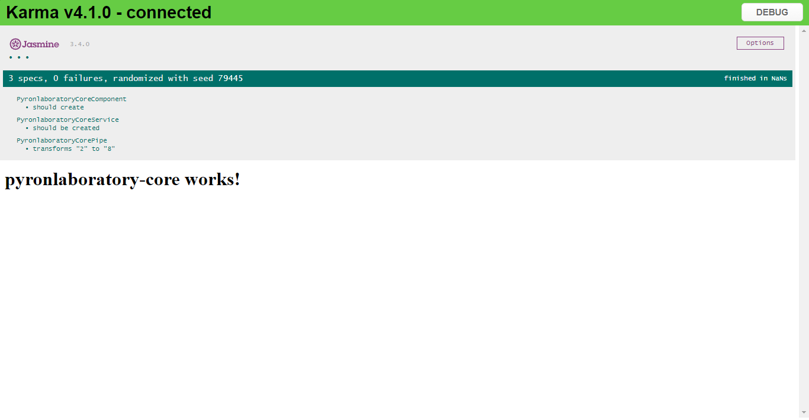
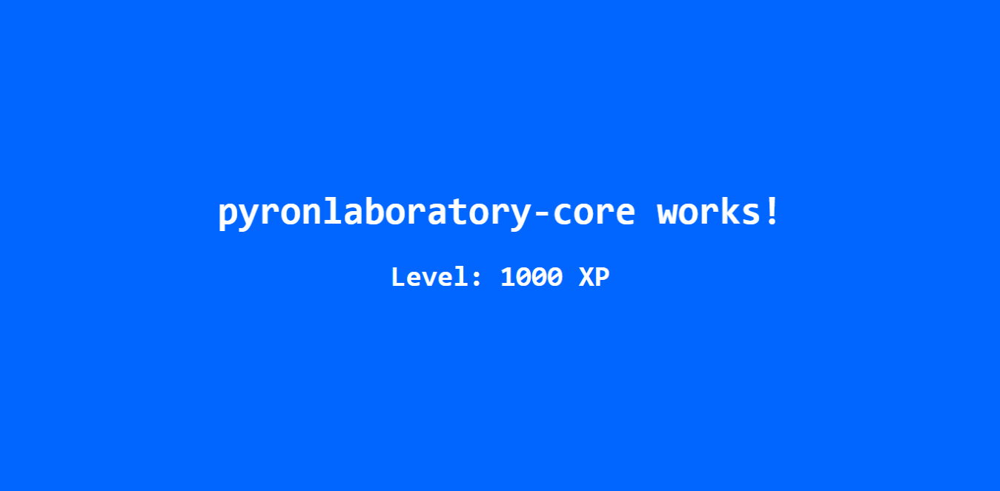

# Integrate custom angular libraries with your angular applications

This README.md file documents the step required to replicate this repository and walks through the various steps involved in the process.

### Prerequisites

- Node.js
- NPM Package Manager
- Angular CLI

## Setup Angular Application

Create a new folder and bootstrap an angular application in the folder. We would be referring to this root folder as **application-workspace**. 

    λ mkdir pyronlaboratory-app && cd pyronlaboratory-app
    
    λ ng new pyronlaboratory

> Make note that *pyronlaboratory-app* is the application workspace name and *pyronlaboratory* is the application name.

## Setup Angular Library 

Change the directory location and create another folder outside the root application-workspace. We would be referring to this as the **library-workspace**.

    λ ng new pyronlaboratory-library --create-application=false 
     
    λ cd pyronlaboratory-library 
    
    λ ng generate library pyronlaboratory-core

> Make note that *pyronlaboratory-library* is the library workspace name and
> *pyronlaboratory-core* is the library name.

Once the library has been bootstraped by the angular-cli, navigate to the `projects/pyronlaboratory-core/src` and  you should see the following files in the source directory of the newly created library

    λ tree /f
    
    Folder PATH listing for volume Windows
    Volume serial number is CA29-4BC6
    C:.
    │   public-api.ts
    │   test.ts
    │
    └───lib
            pyronlaboratory-core.component.spec.ts
            pyronlaboratory-core.component.ts
            pyronlaboratory-core.module.ts
            pyronlaboratory-core.service.spec.ts
            pyronlaboratory-core.service.ts

The `lib/` directory contains all the components, services, directives, classes you would want to share with external angular application.

The `public-api.ts` acts as importing interface between libraries modules and application modules.

    /*
     * Public API Surface of pyronlaboratory-core
     */
    
    export * from './lib/pyronlaboratory-core.component'
    export * from './lib/pyronlaboratory-core.service';
    export * from './lib/pyronlaboratory-core.module';

> **Note**: Its important that `public-api.ts` should contain the relevant exports as well.

You can build your library by running the following command:

    λ ng build my-lib

The library uses a custom building mechanism, among other things, ensures that the library is always built with the [AOT compiler](https://angular.io/guide/aot-compiler), **without** the need to specify the `--prod` flag.

If the build is successful you should see the following logs in your terminal

   
    λ ng build my-lib
    
    Building Angular Package
    
    ------------------------------------------------------------------------------
    Building entry point 'pyronlaboratory-core'
    ------------------------------------------------------------------------------
    Compiling TypeScript sources through ngc
    Bundling to FESM2015
    Bundling to FESM5
    Bundling to UMD
    Minifying UMD bundle
    Copying declaration files
    Writing package metadata
    Built pyronlaboratory-core
    
    ------------------------------------------------------------------------------
    Built Angular Package!
     - from: C:\Users\AYUSH\Desktop\Ronnie\node.js\angular-pyronlaboratory-library\pyronlaboratory-library\projects\pyronlaboratory-core
     - to:   C:\Users\AYUSH\Desktop\Ronnie\node.js\angular-pyronlaboratory-library\pyronlaboratory-library\dist\pyronlaboratory-core
    ------------------------------------------------------------------------------

You can test the library by running Karma and Jasmine, by using the following command:

    λ ng test pyronlaboratory-core

This should log the following in your terminal.

    10% building 8/8 modules 0 active28 11 2020 16:30:31.973:WARN [karma]: No captured browser, open http://localhost:9876/
        28 11 2020 16:30:32.183:INFO [karma-server]: Karma v4.1.0 server started at http://0.0.0.0:9876/
        28 11 2020 16:30:32.189:INFO [launcher]: Launching browsers Chrome with concurrency unlimited
        28 11 2020 16:30:32.333:INFO [launcher]: Starting browser Chrome
        28 11 2020 16:31:21.782:WARN [karma]: No captured browser, open http://localhost:9876/
        28 11 2020 16:31:22.152:INFO [Chrome 86.0.4240 (Windows 10.0.0)]: Connected on socket YsiIzp4bkTkzzSpUAAAA with id 58487256
        Chrome 86.0.4240 (Windows 10.0.0): Executed 2 of 2 SUCCESS (0.61 secs / 0.221 secs)
        TOTAL: 2 SUCCESS
        TOTAL: 2 SUCCESS

You can navigate to http://localhost:9876/ to see the test results in your browser.

## Importing library into your Angular application

Make use of `npm link` to create a symlink for your library workspace. This link could be then used to refer the library modules in your angular application.

Library linking is a two-step process.

First,  type in `npm link`  in a library workspace.

This creates a symlink in the global folder `{prefix}/lib/node_modules/pyronlaboratory-core`.  

Next, in your application workspace, execute  `npm link pyronlaboratory-core`.

This will create a symbolic link and install the library in your application.

In the project workspace, within the `node_modules` you should be able to see your library with an '**@**' appended to it. Now you can easily import relevant components and services from your library into your projects `app.module.ts`.. or lazy-load them if you prefer that approach.

Likewise..
```
import { PyronlaboratoryCoreModule } from 'pyronlaboratory-core';
...
```
And use the selector `lib-pyronlaboratory-core` defined within `PyronlaboratoryCoreComponent` in your applications templates `app.component.html` directly.

Likewise..
```
<lib-pyronlaboratory-core></lib-pyronlaboratory-core>
```

Now, if you start your angular application. You should see *pyronlaboratory-core works!* written in your browser.

----------------
*The following steps are optional and are based around the project requirements.*

## Adding template pipes and directives within the library.

> **Note:** We are creating a simple pipe, that we would be using in the application templates. The same holds for adding a directive or any
> custom typescript class.

Head over to your library workspace, and  navigate to the `projects/pyronlaboratory-core/src`. Add `pyronlaboratory-core.pipe.ts` with the following code:

    // pyronlaboratory-core.pipe.ts
     
    import { Pipe, PipeTransform } from '@angular/core';
    
    @Pipe({name: 'exponentialStrength'})
    export class PyronlaboratoryCorePipe implements PipeTransform {
      transform(value: number, exponent?: number): number {
        return Math.pow(value, isNaN(exponent) ? 1 : exponent);
      }
    }

The above pipe raises the value exponentially. It takes an exponent argument that defaults to 1.

Usage:  

    value | exponentialStrength:exponent

 
 Example:

    {{ 2 | exponentialStrength:10 }} // formats to: 1024

Additionally add a small test in the spec file as follows to test the library's new pipe.

    // pyronlaboratory-core.pipe.spec.ts
    
    import { PyronlaboratoryCorePipe } from './pyronlaboratory-core.pipe';
    
    describe('PyronlaboratoryCorePipe', () => {
      // This pipe is a pure, stateless function so no need for BeforeEach
      const pipe = new PyronlaboratoryCorePipe();
    
      it('transforms "2" to "8"', () => {
        expect(pipe.transform(2, 3)).toBe(8);
      });
    
    });

Build the library again, and run the tests.

    λ ng build pyronlaboratory-core
    
    λ ng test pyronlaboratory-core

Your browser should reflect 3 specs running successfully and terminal should log the following..

    λ ng test pyronlaboratory-core
    
    11% building 10/10 modules 0 active28 11 2020 19:31:56.354:WARN [karma]: No captured browser, open http://localhost:9876/
    28 11 2020 19:31:56.823:INFO [karma-server]: Karma v4.1.0 server started at http://0.0.0.0:9876/
    28 11 2020 19:31:56.825:INFO [launcher]: Launching browsers Chrome with concurrency unlimited
    28 11 2020 19:31:57.060:INFO [launcher]: Starting browser Chrome
    28 11 2020 19:32:54.899:WARN [karma]: No captured browser, open http://localhost:9876/
    28 11 2020 19:32:56.259:INFO [Chrome 86.0.4240 (Windows 10.0.0)]: Connected on socket SUV8qfJX1DVPDQq5AAAA with id 60668947
    Chrome 86.0.4240 (Windows 10.0.0): Executed 3 of 3 SUCCESS (1 sec / 0.39 secs)
    TOTAL: 3 SUCCESS
    TOTAL: 3 SUCCESS




We can now directly start using this pipe within application source code. 

Open your `app.component.html` file and type the following..

    <!-- app.component.html -->
    
    ..
    
    <lib-pyronlaboratory-core></lib-pyronlaboratory-core>
    <h2>Level: {{ 10 | exponentialStrength:3 }} XP</h2>
    
    ...

Additionally I've added a some style attributes within the applications `index.html` file, to make it look a little less horrible.


    <style>
    	body {
    		background: #0066ff;
    		color: white;
    		display: flex;
    		justify-content: center;
    		align-items: center;
    		text-align: center;
    		height: 100vh;
    		overflow: hidden;
    		font-family: monospace;
    		font-size: 2em;
    	}
    </style>
    

 And boom, your browser should show you the below screen..


 
This marks the end of this README.md file.
 
Drop a star if you like this small project!

<a href="https://ko-fi.com/F1F1VEXA" target="_blank"></a>

